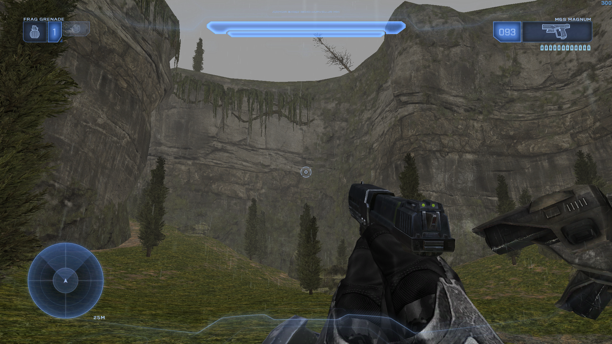

<html>
    

        
    

    A Halo Custom Edition mod, new campaign based on book Halo: The Flood
</html>

---

Helljumper: The Flood is a mod for Halo: Custom Edition developed by the Keymind Studios.

The story follows the perspective of the human soldiers barricaded at Installation 04 during the events of the Battle for Alpha Halo, and their constant struggle to survive the insatiable assault of the Covenant and later the Flood; It mixes elements of strategy and terror with the already classic Halo formula that have made this franchise legendary since more than two decades.

This mod uses [Chimera](https://github.com/SnowyMouse/chimera) as it works as a loader for other 
binary mods as [Balltze](https://github.com/MangoFizz/balltze).

# Screenshots

Campaign it's on development, around 11 to 13 levels are planned.

# The Wilderness Highlands

And all of their kings.
Humans conquered this deployment plateau , to command Sentinels to defend Alpha Base. The Covenant have disabled the platform, leaving the base defenseless and under attack. Destroy them all.
Located near the first half of main campaign.

---

First look at the Singleplayer Prototype from Helljumper: The Flood. 
Work In Progress

# Can I contribute/help?
Of course! We need a lot of help to achieve this project, we have a workflow designed for contributions with support for people being added into the project development as soon as possible.
You can contribute with testing on our beta sessions or directly contributing with the map
content or code contributions.

Join us on our Discord server for more information: https://discord.gg/DAeNYfQvXa